# I Hate Editing

[](https://github.com/ranahaani/i-hate-editing#option-a--skillssh)
[](./LICENSE)
[](./install.md)
[](./SECURITY.md)

Drop in raw talking-head takes. Get back something you can publish.

I named it after a note to myself: never hand back work that still needs fixing
by hand.

<p align="center">
  
</p>

<p align="center">
  <em>Same recording on both phones. Left is what came off the camera; right is
  what came back.
  <a href="https://www.instagram.com/reel/Db3VN1Boyej/">Instagram reel this
  footage shipped as</a>.</em>
</p>

The skill picks the take, decides the repo and the docs page were worth
capturing, where to zoom, which line gets the highlighter, what goes on each
card, and where every sound lands. You say "punchier." It owns the numbers.

## What it does

- Cuts from silence and word onsets, not from scrubbing the timeline
- Re-transcribes a short window around every seam so repeated words and
  mid-clause cuts get caught before you see a preview
- Writes captions that still read on a phone, with a proofread gate before
  they ship
- Captures real pages as tall stills, then scrolls, zooms, and highlights the
  line you said (no mocked screenshots)
- Places free-licensed SFX by intent and aligns peaks so a short window is
  actually audible
- Hands back a package: master, platform crops, ranked thumbnails, post lines
- Remembers corrections in `taste.md` so the tenth video is better than the first
- Runs transcription on your machine with `whisper.cpp`. No cloud STT key.

Built for talking-head reels and YouTube explainers.

## Quick start

### Option A — skills.sh

```bash
npx skills add ranahaani/i-hate-editing
```

That registers the skill with your agent. You still need the local tools
(`ffmpeg`, `whisper-cpp`, Playwright Chromium). Details in
[`install.md`](./install.md).

### Option B — paste this into your agent

Works in Claude Code, Cursor, Codex, and anything else with a shell:

```text
Set up https://github.com/ranahaani/i-hate-editing for me.

Read install.md first: clone the repo to a stable path, symlink it into this
agent's skills directory, install ffmpeg + whisper.cpp, create the Python venv
with playwright + pillow, and optionally run scripts/sfx_library.py install.
Then read SKILL.md for daily usage. After install, don't start editing —
tell me it's ready and wait for me to drop footage into a folder.
```

### Option C — by hand

```bash
git clone https://github.com/ranahaani/i-hate-editing ~/Developer/i-hate-editing
ln -sfn ~/Developer/i-hate-editing ~/.claude/skills/i-hate-editing   # Claude Code
ln -sfn ~/Developer/i-hate-editing ~/.cursor/skills/i-hate-editing   # Cursor
# ln -sfn ~/Developer/i-hate-editing ~/.codex/skills/i-hate-editing  # Codex

cd ~/Developer/i-hate-editing
uv venv .venv && uv pip install --python .venv playwright pillow
.venv/bin/playwright install chromium
brew install ffmpeg whisper-cpp   # macOS; use your package manager on Linux
```

### First edit

```bash
cd /path/to/your/footage
claude   # or your agent of choice
```

> edit these into a reel

It scans the machine, asks five questions, picks a Whisper model for your
language and hardware, and starts. More in [`install.md`](./install.md).

## How it works

The model does not watch the video. Audio is the clock. Scripts do the
mechanical work; the agent only makes taste calls.

```mermaid
%%{init: {
  "theme": "base",
  "themeVariables": {
    "fontFamily": "ui-sans-serif, system-ui, sans-serif",
    "fontSize": "14px",
    "primaryTextColor": "#0f172a",
    "lineColor": "#94a3b8",
    "clusterBkg": "#ffffff00",
    "clusterBorder": "#e2e8f0",
    "edgeLabelBackground": "#ffffff",
    "tertiaryColor": "#f8fafc"
  },
  "flowchart": {
    "curve": "basis",
    "padding": 16,
    "nodeSpacing": 32,
    "rankSpacing": 40,
    "htmlLabels": true
  }
}}%%
flowchart TB
  RAW(["🎬 raw takes"]):::src
  PROF(["🎛️ profile.yml"]):::cfg

  subgraph A["🎧 1 · LISTEN"]
    direction LR
    SCAN(["🔍 scan"]):::listen
    ASR(["🗣️ whisper.cpp"]):::listen
    PACK(["📄 pack"]):::listen
    SIL(["🔇 silences"]):::listen
    TAKES[("takes.md")]:::artBlue
    GAPS[("gaps.json")]:::artBlue
    SCAN --> ASR --> PACK --> TAKES
    SCAN --> SIL --> GAPS
  end

  subgraph B["✂️ 2 · CUT  ·  HARD GATE"]
    direction LR
    EDL[("edl.json")]:::artAmber
    RND(["🎞️ render"]):::cut
    VER{"🛡️ verify<br/>seam re-ASR"}:::gate
    GRD(["🎨 grade"]):::cut
    CUTV[("cut.mp4")]:::artAmber
    EDL --> RND --> CUTV --> VER
    VER -- "❌ fail" --> EDL
    VER -- "✅ pass" --> GRD
  end

  subgraph C["✨ 3 · ENRICH"]
    direction LR
    CAP(["💬 captions"]):::enrich
    PRF(["🌐 proof"]):::enrich
    SFX(["🔊 sfx + music"]):::enrich
    CMP(["🧩 compose"]):::enrich
    MASTER[("master.mp4")]:::artPink
    CAP --> CMP
    PRF --> CMP
    SFX --> CMP
    CMP --> MASTER
  end

  subgraph D["🚀 4 · SHIP"]
    direction LR
    DEL(["📦 deliver"]):::ship
    PKG[("studio/out")]:::artGreen
    REV(["👀 review"]):::ship
    DEL --> PKG --> REV
  end

  RAW --> SCAN
  PROF -.-> SCAN
  PROF -.-> CAP
  TAKES --> EDL
  GAPS --> EDL
  GRD --> CAP
  GRD --> PRF
  GRD --> SFX
  MASTER --> DEL

  classDef src fill:#0f172a,stroke:#facc15,stroke-width:3px,color:#fef08a
  classDef cfg fill:#fef3c7,stroke:#f59e0b,stroke-width:2px,color:#92400e
  classDef listen fill:#dbeafe,stroke:#2563eb,stroke-width:2px,color:#1e3a8a
  classDef cut fill:#ffedd5,stroke:#ea580c,stroke-width:2px,color:#9a3412
  classDef enrich fill:#f3e8ff,stroke:#9333ea,stroke-width:2px,color:#581c87
  classDef ship fill:#dcfce7,stroke:#16a34a,stroke-width:2px,color:#14532d
  classDef gate fill:#fee2e2,stroke:#dc2626,stroke-width:3px,color:#7f1d1d
  classDef artBlue fill:#eff6ff,stroke:#3b82f6,stroke-width:2px,color:#1d4ed8
  classDef artAmber fill:#fffbeb,stroke:#d97706,stroke-width:2px,color:#b45309
  classDef artPink fill:#fdf4ff,stroke:#c026d3,stroke-width:2px,color:#86198f
  classDef artGreen fill:#f0fdf4,stroke:#22c55e,stroke-width:2px,color:#15803d

  style A fill:#eff6ff,stroke:#3b82f6,stroke-width:2px,color:#1e40af
  style B fill:#fff7ed,stroke:#f97316,stroke-width:2px,color:#c2410c
  style C fill:#faf5ff,stroke:#a855f7,stroke-width:2px,color:#7e22ce
  style D fill:#f0fdf4,stroke:#22c55e,stroke-width:2px,color:#15803d

  linkStyle 8 stroke:#dc2626,stroke-width:2.5px
  linkStyle 9 stroke:#16a34a,stroke-width:2.5px
```



`verify` blocks the cut. `review` is when you look at the package. If you change
the cut after captions and sound are built, those timestamps are wrong. Start
that layer over.

```
footage/
├── take-01.mp4      your sources stay put
└── studio/          everything the skill writes
    ├── profile.yml
    ├── taste.md
    ├── transcripts/
    ├── edl.json
    ├── composition/
    └── out/         what you publish from
```

## Why this exists

Two things matter. The rest is plumbing.

Joins love to leave a word sitting there twice. Cuts land mid-clause and flip
what you meant. A whole-file transcript papers over both. So after the cut
renders, verify re-transcribes short windows on each seam. Repeats are
mechanical. Broken clauses get flagged for a human call.

And when you correct something, it sticks. "Captions feel early" goes into
`taste.md` and shows up on the next job. You should not have to teach the same
lesson twice.

You also should not be asked which font, which transition, or what decibel
level. Say *punchier*, *slower*, *less music*. The studio owns the numbers.

## Proof B-roll

Name a repo, an article, a number. The skill opens the real page in a vertical
viewport, grabs one tall still, then scrolls, zooms, and draws a highlighter
across the line you said.

A screen recording locks scroll speed forever. A still plus motion in the
composition can re-time with the cut and sit on the same timeline as your face,
captions, and sound.

Targets are text, not CSS selectors. If the line is not on the page, it says so
instead of grabbing something nearby.

## The rules

Each rule exists because a render failed once and we paid for it.

| File | Covers |
|---|---|
| [`HARD-RULES.md`](./HARD-RULES.md) | Silent failures. Non-negotiable. |
| [`rules/cutting.md`](./rules/cutting.md) | Take selection, seams, what to remove |
| [`rules/hooks.md`](./rules/hooks.md) | Openings, headline, retention |
| [`rules/captions.md`](./rules/captions.md) | Timing, chunking, style |
| [`rules/sound.md`](./rules/sound.md) | Placement, levels, audibility |
| [`rules/motion.md`](./rules/motion.md) | Zooms, pacing, easing |
| [`rules/framing.md`](./rules/framing.md) | Crops, splits, composition |
| [`rules/proof.md`](./rules/proof.md) | Screenshots, B-roll, zoom, highlight |

Agent instructions: [`SKILL.md`](./SKILL.md). Threat model: [`SECURITY.md`](./SECURITY.md).

## Requirements

| Tool | Why | Required |
|---|---|---|
| `ffmpeg` / `ffprobe` | Media | Yes |
| `whisper.cpp` | Local transcription | Yes |
| `node` 22+ | HyperFrames | Yes |
| `playwright` + `pillow` | Proof capture, thumbnails | For proof / deliver |
| `yt-dlp` | Reference footage | Optional |

## Limitations

- Talking-head short-form and explainers. Not travel montages or multi-cam.
- You bring the music bed. The skill ducks it; it does not license tracks.
- Proof capture needs Chromium. Skip it if face + captions is enough.
- First Whisper download is roughly 0.5–3 GB, depending on language and hardware.

## Contributing

Best PR is a rule: what failed, what it cost, what you will never do again. Add
it under [`rules/`](./rules/) or in [`HARD-RULES.md`](./HARD-RULES.md).

```bash
uv venv .venv && uv pip install --python .venv pytest
.venv/bin/pytest -q
```

## Disclaimers

Footage stays on your machine. Scripts can still hit the network for proof
pages, Mixkit SFX, and a pinned HyperFrames package. See
[`SECURITY.md`](./SECURITY.md).

Copyright on `yt-dlp` downloads and music beds is on you. Brand marks from
Simple Icons / Lucide are for editorial use; check trademark rules before ads.

`review.py` binds localhost by default. Only pass `--lan` on a network you
trust. No auth on that server.

## Credit

Composition and rendering by
[HyperFrames](https://github.com/heygen-com/hyperframes) (version pinned in
`scripts/compose.py`).

MIT. Vulnerabilities: [`SECURITY.md`](./SECURITY.md).
