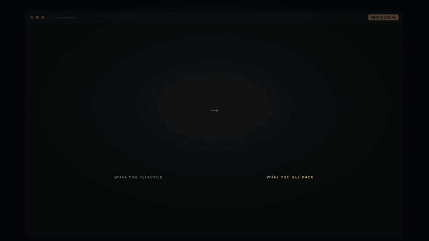

# I Hate Editing

Drop in raw talking-head takes, get back a finished, publishable video.

The name is the origin story. This started as a note to myself: *never hand
back work that still needs fixing by hand.*

<p align="center">
  
</p>

<p align="center"><em>Same recording, both phones. Left is what came off the
camera; right is what came back. <a href="docs/demo.mp4">Full clip</a>.</em></p>

## What you get

Every run returns a package, because that is what an editor hands back:

- The master, graded, mixed and captioned
- Platform variants — vertical, square, landscape
- Thumbnail candidates, ranked
- The strongest lines you actually said, to write the post copy from

## Install

```bash
git clone https://github.com/ranahaani/i-hate-editing ~/Developer/i-hate-editing
ln -sfn ~/Developer/i-hate-editing ~/.claude/skills/i-hate-editing     # Claude Code
cd ~/Developer/i-hate-editing && uv venv .venv && uv pip install --python .venv playwright
brew install ffmpeg whisper-cpp                          # macOS
```

Then point an agent at a folder of takes:

```bash
cd /path/to/your/footage
claude
```

> edit these into a reel

It scans your machine, asks five questions, downloads the right Whisper model
for your language and hardware, and gets to work. Full setup notes in
[`install.md`](./install.md).

## How it works

The model never watches the video. It reads a phrase-level transcript, decides
the cut from speech boundaries and silence, and every mechanical step is a
script it drives:

```
scan → transcribe → pack → cut → verify → grade → captions
     → capture proof → sound → compose → music → deliver → review
```

Two things are worth calling out, because no other tool does them.

**It verifies the cut before you see it.** Joins leave words repeated, and cuts
land mid-clause and invert the meaning of a sentence. Both survive every
automated check, and a whole-file transcript hides them — it condenses exactly
the region you need to inspect. So the rendered cut is re-transcribed in short
windows aligned to each seam, and repeats are found mechanically while clause
completeness is surfaced for judgement.

**It learns your taste.** Corrections become dated rules in `taste.md`, read
before every future edit. Say "captions feel early" once and it never happens
again. The tenth video is better than the first, and not because you configured
anything.

## Proof B-roll

When you name a repo, an article or a number, i-hate-editing captures the real page —
in vertical, so it fills a 9:16 frame — then scrolls it, zooms onto the exact
text you said, and sweeps a highlighter across the line.

It captures a **still**, not a screen recording. A recording bakes in its
scroll speed permanently: it cannot be re-synced when the cut changes, slowed
on the line that matters, or zoomed mid-scroll. A still plus authored motion
stays frame-accurate and composites in one timeline with your face, captions
and sound.

Targets are found by **text**, not CSS selectors — selectors are per-site and
mobile layouts hide half of them, and text is how you describe the beat anyway:
*zoom to the 100k stars*. A target that genuinely is not on the page is
reported missing rather than substituted with something close.

## Configuration is a failure state

You are never asked which font, which transition, or what decibel level. The
studio decides, shows you, and takes plain direction — *punchier*, *slower*,
*less music*. `profile.yml` holds your brand and language; everything else is a
craft decision the rules already settled.

## The rules

The rules are the product. Each states the failure it prevents.

| File | Covers |
|---|---|
| [`HARD-RULES.md`](./HARD-RULES.md) | Correctness. Silent failures. Non-negotiable. |
| [`rules/cutting.md`](./rules/cutting.md) | Take selection, seams, what to remove |
| [`rules/hooks.md`](./rules/hooks.md) | Openings, headline, retention |
| [`rules/captions.md`](./rules/captions.md) | Timing, chunking, style |
| [`rules/sound.md`](./rules/sound.md) | Placement, levels, audibility |
| [`rules/motion.md`](./rules/motion.md) | Zooms, pacing, easing |
| [`rules/framing.md`](./rules/framing.md) | Crops, splits, composition |
| [`rules/proof.md`](./rules/proof.md) | Screenshots, B-roll, zoom, highlight |

Found a failure mode of your own? A rule with the defect it prevents and what
it cost is the most useful contribution you can make.

## Requirements

| Tool | Why | Required |
|---|---|---|
| `ffmpeg` / `ffprobe` | All media processing | Yes |
| `whisper.cpp` | Transcription, local | Yes |
| `node` 22+ | HyperFrames compositions | Yes — Claude Code needs it anyway |
| `playwright` | Capturing pages for proof B-roll | For proof shots |
| `yt-dlp` | Downloading reference footage | Optional |

## Credit

Composition and rendering by [HyperFrames](https://github.com/heygen-com/hyperframes).
Several production-correctness rules are adapted from
[video-use](https://github.com/browser-use/video-use) (MIT), which isolated
them cleanly.

MIT licensed.
