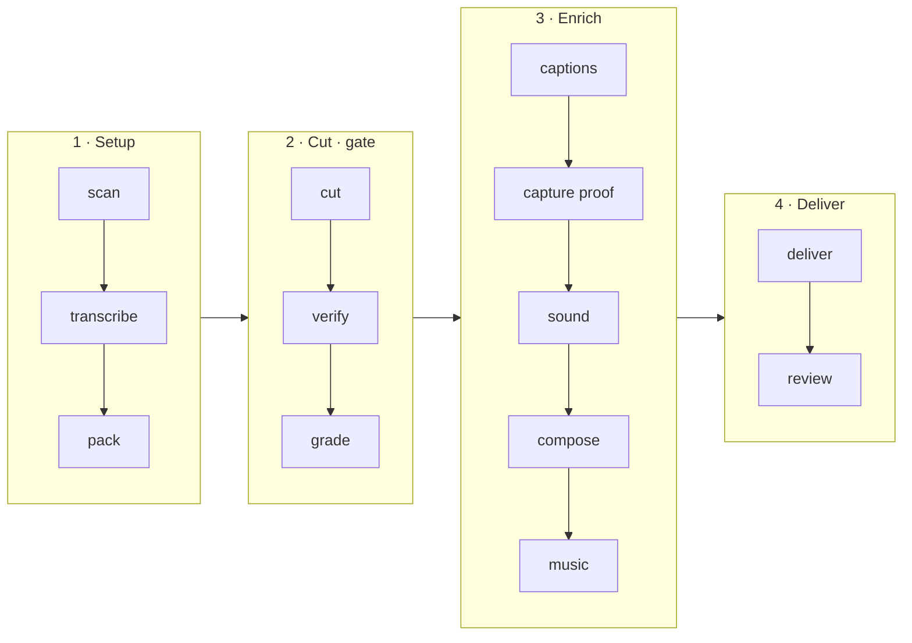

# I Hate Editing

[](https://skills.sh/ranahaani/i-hate-editing)
[](./LICENSE)
[](./install.md)
[](./SECURITY.md)

Drop in raw talking-head takes, get back a finished, publishable video.

The name is the origin story. This started as a note to myself: *never hand
back work that still needs fixing by hand.*

<p align="center">
  
</p>

<p align="center">
  <em>One recording. Left is what came off the camera, right is what came back —
  and the terminal underneath is the run that produced it.
  <a href="docs/demo.mp4">Full clip</a> ·
  <a href="https://www.instagram.com/reel/Db3VN1Boyej/">the reel this footage came from</a>.</em>
</p>

Everything on the right was decided by the skill: which take to keep, that the
repo and the docs page were worth capturing, where to zoom, which line to draw
the marker across, what each card should be, and where every sound lands.

## What it does

- **Cuts from speech, not eyeballing** — silence detection + word onsets own the timeline
- **Verifies every seam** — re-transcribes short windows around cuts; catches repeats and mid-clause breaks before you see a preview
- **Captions that survive a phone** — timed chunks, proofread gate, brand-aware emphasis
- **Proof B-roll from real pages** — captures a tall still, then scrolls / zooms / highlights the exact text you said (never a mocked screenshot)
- **Scores the edit** — free-licensed SFX placed by intent, peaks aligned so short windows are actually audible
- **Delivers a package** — master, platform variants, ranked thumbnails, post lines — not a lonely `cut.mp4`
- **Learns your taste** — corrections land in `taste.md` and apply to the next video
- **Stays on your machine** — `whisper.cpp` locally; no ElevenLabs / cloud STT key required

Opinionated on purpose. Talking-head reels and YouTube explainers. Not a general
montage editor — if you want that, see [video-use](https://github.com/browser-use/video-use).

## Quick start

### Option A — paste this into your agent

Works in Claude Code, Cursor, Codex, and any agent with shell access:

```text
Set up https://github.com/ranahaani/i-hate-editing for me.

Read install.md first: clone the repo to a stable path, symlink it into this
agent's skills directory, install ffmpeg + whisper.cpp, create the Python venv
with playwright + pillow, and optionally run scripts/sfx_library.py install.
Then read SKILL.md for daily usage. After install, don't start editing —
tell me it's ready and wait for me to drop footage into a folder.
```

### Option B — skills.sh

```bash
npx skills add ranahaani/i-hate-editing
```

Then finish machine deps from [`install.md`](./install.md) (`ffmpeg`,
`whisper-cpp`, Playwright Chromium). The CLI registers the skill; the scan
still needs the local tools.

### Option C — manual

```bash
git clone https://github.com/ranahaani/i-hate-editing ~/Developer/i-hate-editing
ln -sfn ~/Developer/i-hate-editing ~/.claude/skills/i-hate-editing   # Claude Code
ln -sfn ~/Developer/i-hate-editing ~/.cursor/skills/i-hate-editing   # Cursor
# ln -sfn ~/Developer/i-hate-editing ~/.codex/skills/i-hate-editing  # Codex

cd ~/Developer/i-hate-editing
uv venv .venv && uv pip install --python .venv playwright pillow
.venv/bin/playwright install chromium
brew install ffmpeg whisper-cpp   # macOS; use your package manager on Linux
```

### First edit

```bash
cd /path/to/your/footage
claude   # or cursor agent / codex / …
```

> edit these into a reel

It scans the machine, asks five questions, picks a Whisper model for your
language and hardware, and gets to work. Full notes in [`install.md`](./install.md).

## How it works

The model never watches the video. It reads a phrase-level transcript, decides
the cut from speech boundaries and silence, and every mechanical step is a
script it drives:



`verify` is a hard gate on the cut; `review` is the human gate on the package.
Captions, motion and sound all inherit timestamps from the approved cut — change
the cut later and every downstream step is invalidated.

```
footage/
├── take-01.mp4          ← your sources, untouched
└── studio/              ← everything the skill writes
    ├── profile.yml
    ├── taste.md
    ├── transcripts/
    ├── edl.json
    ├── composition/
    └── out/             ← the deliverable package
```

## Why this exists

Two things are the product. Everything else is scaffolding.

**It verifies the cut before you see it.** Joins leave words repeated, and cuts
land mid-clause and invert the meaning of a sentence. Both survive every
automated check, and a whole-file transcript hides them. So the rendered cut is
re-transcribed in short windows aligned to each seam; repeats are found
mechanically while clause completeness is surfaced for judgement.

**It learns your taste.** Corrections become dated rules in `taste.md`, read
before every future edit. Say "captions feel early" once and it never happens
again. The tenth video is better than the first, and not because you configured
anything.

**Configuration is a failure state.** You are never asked which font, which
transition, or what decibel level. The studio decides, shows you, and takes
plain direction — *punchier*, *slower*, *less music*.

## Proof B-roll

When you name a repo, an article or a number, i-hate-editing captures the real
page — in vertical, so it fills a 9:16 frame — then scrolls it, zooms onto the
exact text you said, and sweeps a highlighter across the line.

It captures a **still**, not a screen recording. A recording bakes in its
scroll speed permanently. A still plus authored motion stays frame-accurate and
composites in one timeline with your face, captions and sound.

Targets are found by **text**, not CSS selectors. A target that genuinely is not
on the page is reported missing rather than substituted with something close.

## The rules

The rules are the product. Each states the failure it prevents.

| File | Covers |
|---|---|
| [`HARD-RULES.md`](./HARD-RULES.md) | Correctness. Silent failures. Non-negotiable. |
| [`rules/cutting.md`](./rules/cutting.md) | Take selection, seams, what to remove |
| [`rules/hooks.md`](./rules/hooks.md) | Openings, headline, retention |
| [`rules/captions.md`](./rules/captions.md) | Timing, chunking, style |
| [`rules/sound.md`](./rules/sound.md) | Placement, levels, audibility |
| [`rules/motion.md`](./rules/motion.md) | Zooms, pacing, easing |
| [`rules/framing.md`](./rules/framing.md) | Crops, splits, composition |
| [`rules/proof.md`](./rules/proof.md) | Screenshots, B-roll, zoom, highlight |

Daily agent instructions live in [`SKILL.md`](./SKILL.md). Security surfaces in
[`SECURITY.md`](./SECURITY.md).

## Requirements

| Tool | Why | Required |
|---|---|---|
| `ffmpeg` / `ffprobe` | All media processing | Yes |
| `whisper.cpp` | Transcription, local | Yes |
| `node` 22+ | HyperFrames compositions | Yes |
| `playwright` + `pillow` | Proof capture + thumbnail ranking | For proof / deliver |
| `yt-dlp` | Reference footage | Optional |

## Limitations

- Built for **talking-head** short-form and YouTube explainers, not travel montages or multi-cam interviews
- Music beds are yours to supply — the skill ducks them; it does not license tracks
- Proof capture needs Chromium via Playwright; skip it if you only want face + captions
- First-run Whisper model download can be 0.5–3 GB depending on language and hardware

## Contributing

The highest-value contribution is a **rule**: a failure mode you hit, what it
cost, and the craft decision that prevents it. Open a PR that adds a short
section to the relevant file under [`rules/`](./rules/) or
[`HARD-RULES.md`](./HARD-RULES.md).

Smoke tests:

```bash
uv venv .venv && uv pip install --python .venv pytest
.venv/bin/pytest -q
```

## Disclaimers

- Footage stays local, but scripts can open network URLs (proof capture),
  download free Mixkit SFX, or pull a pinned HyperFrames package via `npx`.
  See [`SECURITY.md`](./SECURITY.md).
- You are responsible for copyright on anything you download with `yt-dlp` or
  mux as a music bed.
- Brand marks (Simple Icons / Lucide) are for editorial use — respect each
  company's trademark guidelines for ads.
- `scripts/review.py` defaults to localhost. Pass `--lan` only on a trusted
  network; that mode has no authentication.

## Credit

Composition and rendering by [HyperFrames](https://github.com/heygen-com/hyperframes)
(pinned in `scripts/compose.py`). Several production-correctness rules are
adapted from [video-use](https://github.com/browser-use/video-use) (MIT).

MIT licensed. Report vulnerabilities via [`SECURITY.md`](./SECURITY.md).
