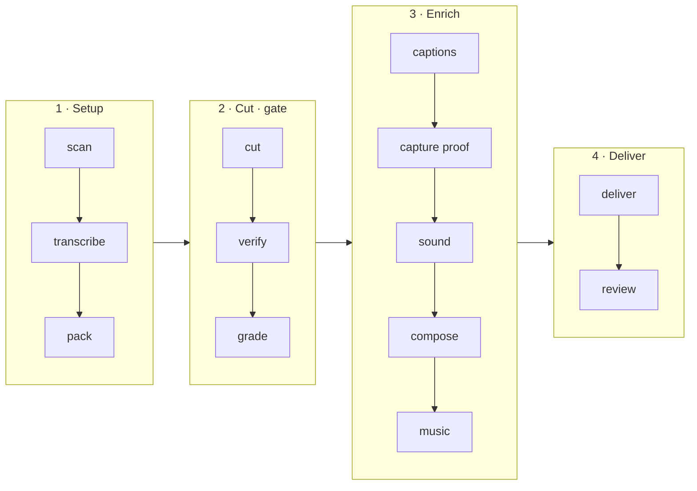

# I Hate Editing

Drop in raw talking-head takes, get back a finished, publishable video.

The name is the origin story. This started as a note to myself: *never hand
back work that still needs fixing by hand.*

<p align="center">
  
</p>

<p align="center">
  <em>One recording. Left is what came off the camera, right is what came back —
  and the terminal underneath is the run that produced it.
  <a href="https://www.instagram.com/reel/Db3VN1Boyej/">The reel this footage was recorded for</a>.</em>
</p>

Everything on the right was decided by the skill: which take to keep, that the
repo and the docs page were worth capturing, where to zoom, which line to draw
the marker across, what each card should be, and where every sound lands.

## What it does

**Cut**
- Picks the best take across your retakes, and stitches a strong opening to a strong ending when neither take is clean throughout
- Cuts on silence, never mid-word, with padding that absorbs transcript drift
- Removes filler, false starts and dead air at a pace you set
- Re-transcribes the result in windows aligned to each seam, hunting repeated words and clauses cut mid-thought

**Look**
- Half-screen cards, full-frame cards, numbered lists, and a hook band
- An animated terminal card, for showing a command actually running
- Brand marks and brand colours pulled from a public-domain icon set
- Held zooms, rotating entrances chosen from what the element is, and lighting correction

**Proof**
- Captures the real page when you name a repo, a product or an article — in your delivery aspect, never a desktop screenshot squeezed into 9:16
- Finds targets by the words you said, not CSS selectors
- Scrolls, zooms onto the phrase, and sweeps a highlighter across the line
- Reports a target as missing rather than substituting something close

**Sound**
- Nineteen categories, placed by what is on screen: a click per list row, a glitch cutting to a screen, a shutter when a screenshot lands
- Every sound aligned by its **peak**, not its start, and led a frame or two ahead of the picture
- A music bed ducked under the voice by sidechain

**Captions**
- Two to three words a chunk, timed to word onsets and biased late, never early
- Big-keyword styling with no background box
- Repositioned per layout, and suppressed under a full-frame card
- Name restoration for what ASR mangles, plus an optional model pass

**Gates that fail the build**
- A stretch with nothing new on screen
- No proof shot when the script names something real
- A sound that is inaudible, or louder than the voice
- Captions still carrying an unproofread machine pass
- Nothing happening in the first two seconds

**Delivered**
- Master, platform variants, ranked thumbnail candidates, and the lines to write your post copy from
- A local review page that opens in your browser and prints an address for your phone

## How this differs from video-use

[video-use](https://github.com/browser-use/video-use) is the closest thing to
this and it is good software — eight of the correctness rules in
`HARD-RULES.md` are adapted from it with thanks. It is also solving a
different problem, so the two are worth telling apart.

| | video-use | i-hate-editing |
|---|---|---|
| Scope | Any video — talking head, montage, travel, interview | Short-form talking head, one speaker |
| Craft direction | *"Artistic freedom is the default"* — worked examples, taste left to you | Roughly forty specific rules, each stating the failure it prevents |
| Transcription | Hosted Scribe; running Whisper locally is listed as an anti-pattern | Whisper on your machine, model chosen by language and hardware |
| Cost | Needs an `ELEVENLABS_API_KEY` | No key, no account, nothing leaves the machine |
| B-roll | Generated animation slots | Captures the real page you named, and marks the line you said |
| Sound | Not covered | Nineteen categories placed semantically, verified audible in the render |
| Memory | Per-project notes | Corrections become durable rules that apply to every future edit |

If you are editing a documentary, a montage, or anything that is not one
person talking to a camera, use video-use. It generalises and this does not.

The trade this makes is deliberate: an agent handed ffmpeg and artistic freedom
produces the median boring cut every time. Everything here is opinionated
because taste, written down as numbers, is the part that was missing.

## What you get

Every run returns a package, because that is what an editor hands back:

- The master, graded, mixed and captioned
- Platform variants — vertical, square, landscape
- Thumbnail candidates, ranked
- The strongest lines you actually said, to write the post copy from

## Install

```bash
git clone https://github.com/ranahaani/i-hate-editing ~/Developer/i-hate-editing
ln -sfn ~/Developer/i-hate-editing ~/.claude/skills/i-hate-editing     # Claude Code
ln -sfn ~/Developer/i-hate-editing ~/.cursor/skills/i-hate-editing     # Cursor
# ln -sfn ~/Developer/i-hate-editing ~/.codex/skills/i-hate-editing    # Codex
cd ~/Developer/i-hate-editing && uv venv .venv && uv pip install --python .venv playwright pillow
brew install ffmpeg whisper-cpp                          # macOS
```

Then point an agent at a folder of takes:

```bash
cd /path/to/your/footage
claude
```

> edit these into a reel

It scans your machine, asks five questions, downloads the right Whisper model
for your language and hardware, and gets to work. Full setup notes in
[`install.md`](./install.md).

## How it works

The model never watches the video. It reads a phrase-level transcript, decides
the cut from speech boundaries and silence, and every mechanical step is a
script it drives:



`verify` is a hard gate on the cut; `review` is the human gate on the package.
Captions, motion and sound all inherit timestamps from the approved cut — change
the cut later and every downstream step is invalidated.

Two things are worth calling out, because no other tool does them.

**It verifies the cut before you see it.** Joins leave words repeated, and cuts
land mid-clause and invert the meaning of a sentence. Both survive every
automated check, and a whole-file transcript hides them — it condenses exactly
the region you need to inspect. So the rendered cut is re-transcribed in short
windows aligned to each seam, and repeats are found mechanically while clause
completeness is surfaced for judgement.

**It learns your taste.** Corrections become dated rules in `taste.md`, read
before every future edit. Say "captions feel early" once and it never happens
again. The tenth video is better than the first, and not because you configured
anything.

## Proof B-roll

When you name a repo, an article or a number, i-hate-editing captures the real page —
in vertical, so it fills a 9:16 frame — then scrolls it, zooms onto the exact
text you said, and sweeps a highlighter across the line.

It captures a **still**, not a screen recording. A recording bakes in its
scroll speed permanently: it cannot be re-synced when the cut changes, slowed
on the line that matters, or zoomed mid-scroll. A still plus authored motion
stays frame-accurate and composites in one timeline with your face, captions
and sound.

Targets are found by **text**, not CSS selectors — selectors are per-site and
mobile layouts hide half of them, and text is how you describe the beat anyway:
*zoom to the 100k stars*. A target that genuinely is not on the page is
reported missing rather than substituted with something close.

## Configuration is a failure state

You are never asked which font, which transition, or what decibel level. The
studio decides, shows you, and takes plain direction — *punchier*, *slower*,
*less music*. `profile.yml` holds your brand and language; everything else is a
craft decision the rules already settled.

## The rules

The rules are the product. Each states the failure it prevents.

| File | Covers |
|---|---|
| [`HARD-RULES.md`](./HARD-RULES.md) | Correctness. Silent failures. Non-negotiable. |
| [`rules/cutting.md`](./rules/cutting.md) | Take selection, seams, what to remove |
| [`rules/hooks.md`](./rules/hooks.md) | Openings, headline, retention |
| [`rules/captions.md`](./rules/captions.md) | Timing, chunking, style |
| [`rules/sound.md`](./rules/sound.md) | Placement, levels, audibility |
| [`rules/motion.md`](./rules/motion.md) | Zooms, pacing, easing |
| [`rules/framing.md`](./rules/framing.md) | Crops, splits, composition |
| [`rules/proof.md`](./rules/proof.md) | Screenshots, B-roll, zoom, highlight |

Found a failure mode of your own? A rule with the defect it prevents and what
it cost is the most useful contribution you can make.

## Requirements

| Tool | Why | Required |
|---|---|---|
| `ffmpeg` / `ffprobe` | All media processing | Yes |
| `whisper.cpp` | Transcription, local | Yes |
| `node` 22+ | HyperFrames compositions | Yes — Claude Code needs it anyway |
| `playwright` + `pillow` | Proof capture + thumbnail ranking | For proof / deliver |
| `yt-dlp` | Downloading reference footage | Optional |

## Disclaimers

- **Your footage stays local**, but scripts can still open network URLs (proof
  capture), download free SFX (Mixkit), or pull a pinned HyperFrames package
  via `npx`. See [`SECURITY.md`](./SECURITY.md).
- **`yt-dlp` and music beds:** you are responsible for the copyright status of
  anything you download or mux under speech. This skill does not grant rights
  to third-party media.
- **Mixkit SFX** are fetched at install time under Mixkit's free licence as
  recorded per file. Scraped category pages can change; if install fails,
  placement skips missing categories.
- **Brand marks** (Simple Icons / Lucide) are for editorial use in your own
  videos. Respect each company's trademark guidelines for commercial ads.
- **Review on a phone:** `scripts/review.py` defaults to localhost. Pass
  `--lan` only on a trusted network — that mode has no authentication.

## Credit

Composition and rendering by [HyperFrames](https://github.com/heygen-com/hyperframes)
(pinned in `scripts/compose.py`). Several production-correctness rules are
adapted from [video-use](https://github.com/browser-use/video-use) (MIT), which
isolated them cleanly.

MIT licensed. Report vulnerabilities via [`SECURITY.md`](./SECURITY.md).
